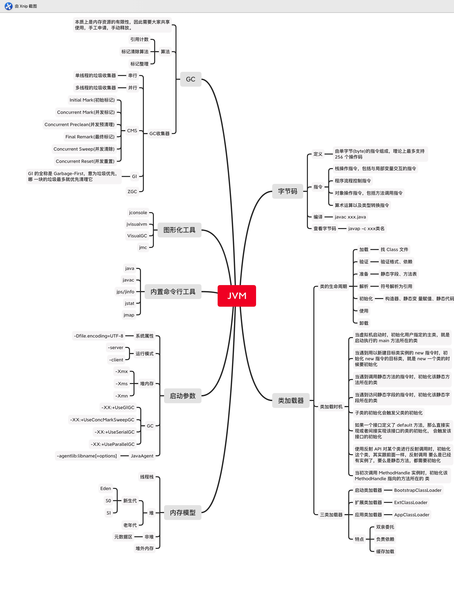
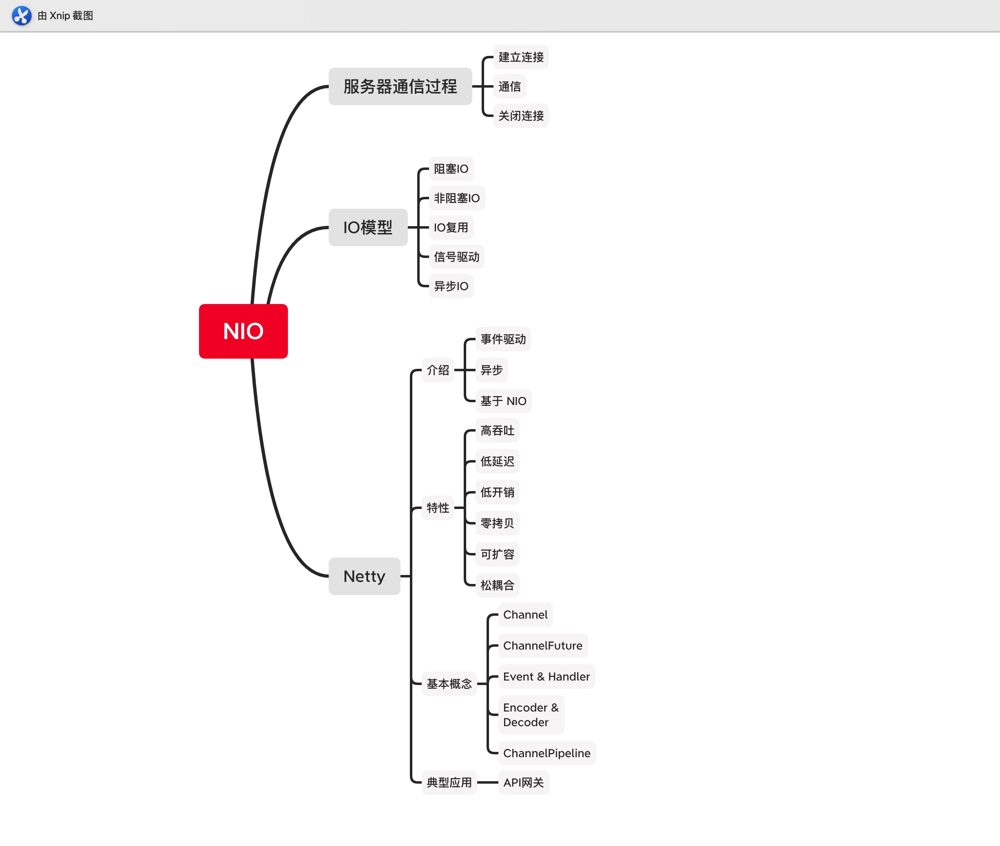
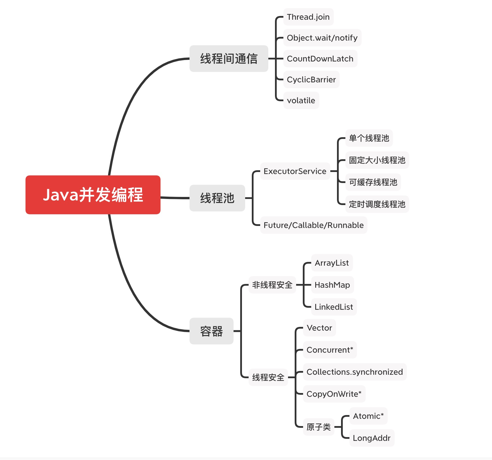
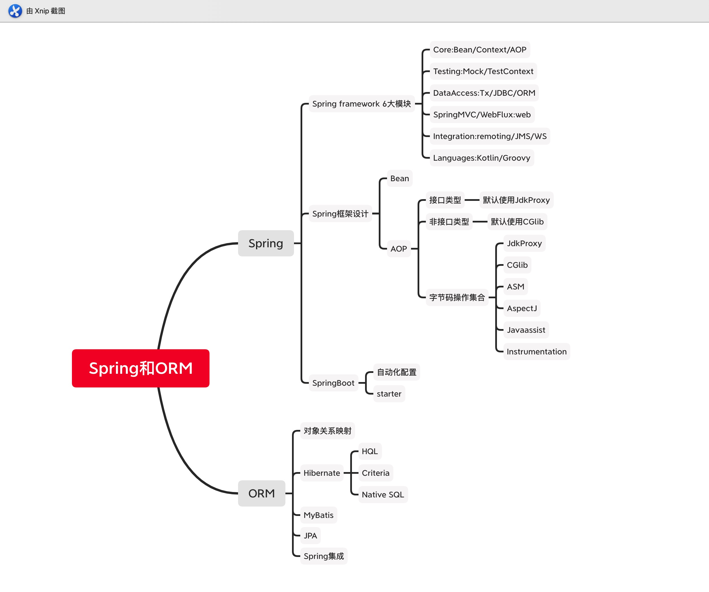
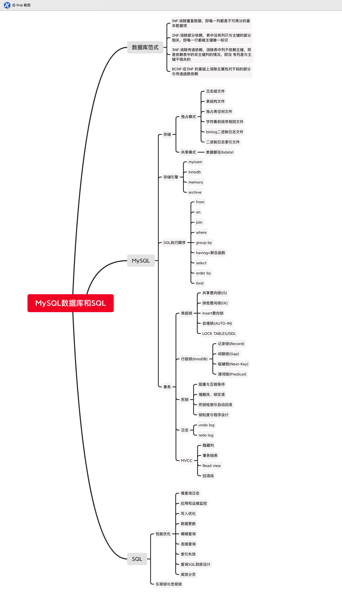
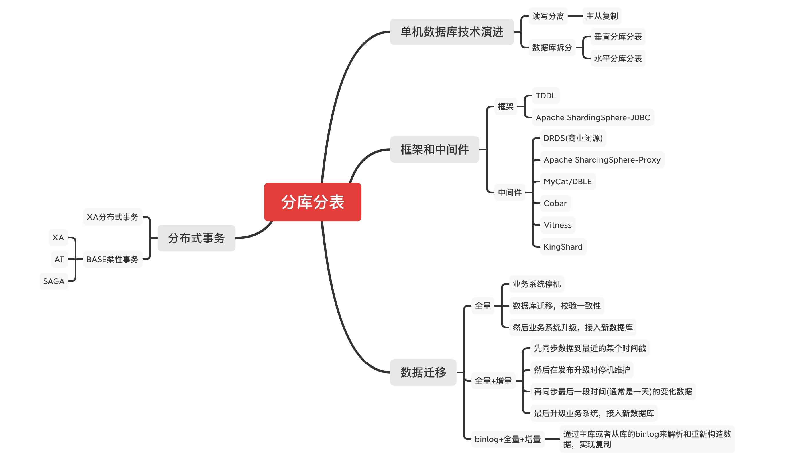
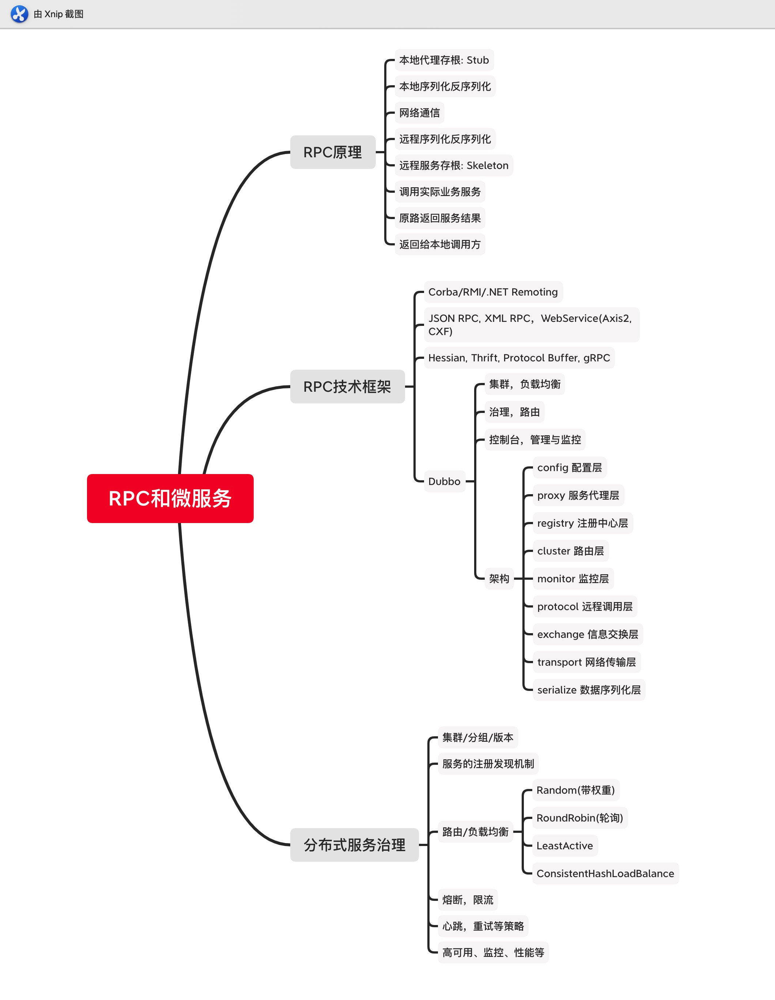
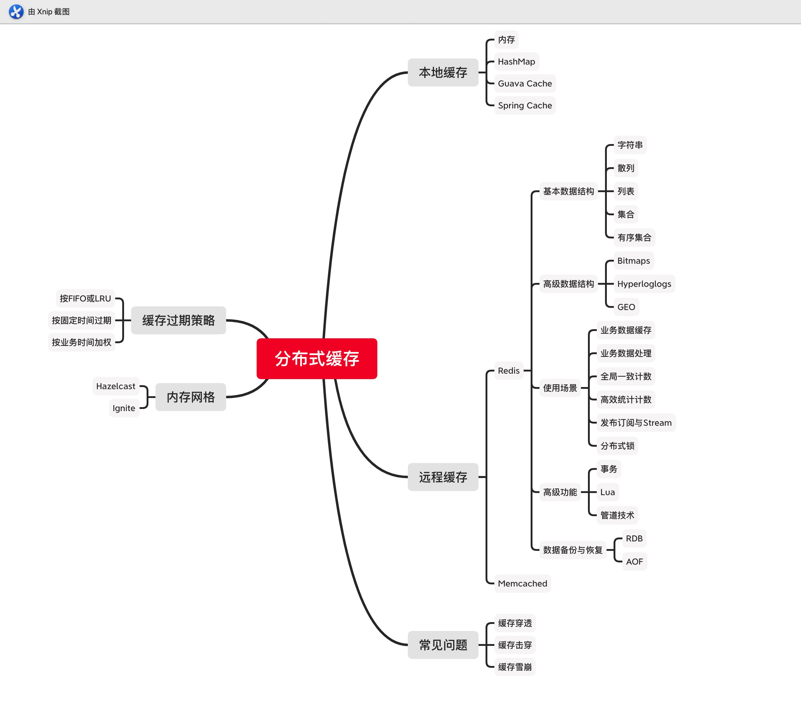
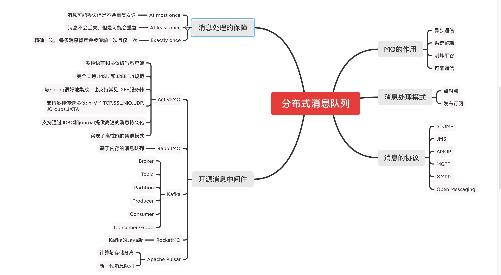

# 毕业项目

> 1～9项均有脑图，只不过加载可能有点慢 

### 1、JVM

Java 是一种面向对象、静态类型、编译执行，有 VM/GC 和运行时、跨平台的高级语言。
JVM 主要知识点为：
* 字节码技术
* 类加载
* 内存模型
* 命令行及启动参数
* 图形化工具
* GC

了解字节码技术，可以让我们深入 Java 语言底层的奥秘，学习类加载可以使我们深入 class 文件的细节。
了解内存模型，有助于我们从整体把握 JVM,当出现内存溢出或内存泄露的时候，不至于手忙脚乱。
了解 GC 原理和算法，有助于我们尽量减少 STW 的时间，提升系统响应时间和吞吐量，特别要学会解读 GC 日志。
图形化工具使我们分析 JVM 内存和 GC 时事半功倍。

### 2、NIO

##### 为什么要使用NIO
Java 中使用 Socket 进行客户端和服务端之间的网络通信，NIO 是相对传统的 BIO 来说的，NIO 是为了解决传统 BIO 的线程资源浪费，数据传输低效的问题
而产生的。Java原生的 NIO 工具包使用不方备，Netty 正是为了简化网络编程应运而生的框架，具有低延迟、高并发、高吞吐的特点。 

##### IO模型
* 阻塞IO:一般通过在 while(true) 循环中服务端会调用 accept() 方法等待接收客户端的连接的方式监听请求，请求一旦接收到一个连接请求，就可以建立通信套接字，在这个通信套接字上进行读写操作
* 非阻塞IO:和阻塞 IO 类比，内核会立即返回，返回后获得足够的 CPU 时间继续做其它的事情
* IO多路复用:在单个线程里同时监控多个套接字，通过 select 或 poll 轮询所负责的所有 socket，当某个 socket 有数据到达了，就通知用户进程
* 信号驱动IO：信号驱动 IO 与 BIO 和 NIO 最大的区别就在于，在 IO 执行的数据准备阶段，不会阻塞用户进程
* 异步IO:用户进程发出系统调用后立即返回，内核等待数据准备完成，然后将数据拷贝到用户进程缓冲区，然后发送信号告诉用户进程 IO 操作执行完毕

##### Netty线程模型
* Reactor 单线程模式
* 非主从 Reactor 多线程模式
* 主从 Reactor 多线程模式

### 3、并发编程

##### 多线程
为什么会有多线程？本质原因是摩尔定律失效 -> 多核+分布式 时代的来临。操作系统以线程作为基本的调度单元，多 CPU 核心意味着同时操作系统有更多的并行计算资源可以使用。

##### 线程的状态
* 调用 Thread#start() 后，线程进入 Runnable 状态
* 经操作系统调度，变为 Running 状态
* Running 状态的线程如果被 interrupt 则再次进入 Runnable 状态
* Running 状态的线程如果 exit 后，进入 Terminated 状态
* Running 状态的线程调用 wait 后，进入 Non-Runnable 状态
* Non-Runnable 状态的线程调用 notify 后，再次进入 Runnable 状态

##### Thread的状态改变操作
* Thread.sleep(long millis)
* Thread.yield()
* t.join()/t.join(long millis)
* obj.wait()
* obj.notify()

##### 线程安全
多个线程竞争同一资源时，如果对资源的访问顺序敏感，就称存在竞态条件。导致竞态条件发生的代码区称作临界区。不进行恰当的控制，会导致线程安全问题

##### 并发相关的性质
* 原子性：对基本数据类型的变量的读取和赋值操作是原子性操作，即这些操作是不可被中断的，要么执行，要么不执行
* 可见性：对于可见性，Java 提供了 volatile 关键字来保证可见性
* 有序性：Java 允许编译器和处理器对指令进行重排序，但是重排序过程不会影响到单线程程序的执行，却会影响到多线程并发执行的正确性

##### 线程池
* Excutor: 执行者 – 顶层接口，从功能上看，就是一个任务执行器
* ExcutorService: 接口 API 
* ThreadFactory: 线程工厂 
* Excutors: 工具类

##### Java并发包
* 锁机制类 Locks : Lock, Condition, ReadWriteLock
* 原子操作类 Atomic : AtomicInteger
* 线程池相关类 Executer : Future, Callable, Executor
* 信号量三组工具类 Tools : CountDownLatch, CyclicBarrier, Semaphore 
* 并发集合类 Collections : CopyOnWriteArrayList, ConcurrentMap

##### 锁
* synchronized
* Lock

### 4、Spring 和 ORM 等框架

##### Spring Bean生命周期
* 实例化 Bean 实例
* 设置对象属性
* 检查 Aware 的相关接口并设置依赖项
* BeanPostProcessor 前置处理
* InitializingBean
* 自定义 init 方法
* BeanPostProcessor 后置处理
* 注册 Destruction 相关接口
* DisposalBean
* 自定义 destroy 方法

##### Spring XML配置原理
* 根据Bean的字段结构，自动生成XSD 
* 根据Bean的字段结构，配置XML文件

##### Spring Boot
* 创建独立运行的Spring应用
* 直接嵌入Tomcat或Jetty，Undertow，无需部署WAR包
* 提供限定性的starter依赖简化配置(就是脚手架)
* 在必要时自动化配置Spring和其他三方依赖库
* 提供生产production-ready 特性，例如指标度量，健康检查，外部配置等 
* 完全零代码生产和不需要XML配置

##### ORM
* Hibernate:是一个开源的对象关系映射框架，它对JDBC进行了非常轻量级的对象封装，它将POJO与数据库表建立映射关系，是一个全自动的orm框架，hibernate可以自动生成SQL语句，自动执行
* MyBatis:是一款优秀的持久层框架，它支持定制化 SQL、存储过程以及高级映射。MyBatis 避免了几乎所有的 JDBC 代码和手动设置参数以及获取结果集。MyBatis 可以使用简单的 XML 或注解来配置和映射原生信息

##### MyBatis与Hibernate比较
* Mybatis优点:原生SQL(XML语法)，直观，对DBA友好 
* Hibernate优点:简单场景不用写SQL(HQL、Cretiria、SQL) 
* Mybatis缺点:繁琐，可以用MyBatis-generator、MyBatis-Plus之类的插件 
* Hibernate缺点:对DBA不友好

### 5、MySQL数据库和SQL

##### MySQL 5.6/5.7的差异
5.7支持:
* 多主
* MGR高可用 
* 分区表
* json
* 性能
* 修复XA等

##### MySQL 5.7/8.0的差异
* 通用表达式
* 窗口函数
* 持久化参数
* 自增列持久化
* 默认编码utf8mb4 
* DDL原子性
* JSON增强
* 不再对group by进行隐式排序

##### MySQL 执行流程
* 查询缓存
* 解析器
* 预处理器
* 查询优化器
* 查询执行计划
* 查询执行引擎
* 存储引擎 API 调用

##### 事务可靠性模型ACID
* Atomicity: 原子性, 一次事务中的操作要么全部成功, 要么全部失败
* Consistency: 一致性, 跨表、跨行、跨事务, 数据库始终保持一致状态
* Isolation: 隔离性, 可见性, 保护事务不会互相干扰, 包含4种隔离级别
* Durability:持久性, 事务提交成功后,不会丢数据。如电源故障, 系统崩溃

##### 事务隔离级别
* 读未提交: READ UNCOMMITTED
* 读已提交: READ COMMITTED
* 可重复读: REPEATABLE READ
* 可串行化: SERIALIZABLE

##### SQL优化
* 写入优化：大批量写入的优化、Multiple Values/Add Batch 减少交互、索引和约束问题
* 数据更新：数据的范围更新注意GAP Lock的问题
* 模糊查询：前缀匹配，必要时借助solr/ES
* 连接查询：避免笛卡尔积
* 索引失效：NULL，not，not in，函数等

### 6、分库分表

##### 为什么要分库分表
* 传统单机数据库在容量、性能、可用性和运维成本这三方面已经难于满足互联网的海量数据场景
* 关系型数据库大多采用 B+树类型的索引，在数据量超过阈值的情况下，索引深度的增加也将使得磁盘访问的 IO 次数增加，进而导致查询性能的下降

##### 数据库垂直拆分
* 拆库:将一个数据库，拆分成多个提供不同业务数据处理能力的数据库
* 拆表:如果单表数据量过大，还可能需要对单表进行拆分

##### 数据库水平拆分
* 按主键分库分表
* 按时间分库分表

##### 分库还是分表，如何选择
一般情况下，如果数据本身的读写压力较大，磁盘 IO 已经成为瓶颈，那么分库比分表要好。分库将数据分散到不同的数据库实例，使用不同的磁盘，从而可以并行提升整个集群的并行数据处理能力。相反的情况下，可以尽量多考虑分表，降低单表的数据量，从而减少单表操作的时间，同时也能在单个数据库上使用并行操作多个表来增加处理能力。

##### 分布式事务
分库分表后，可能带来分布式事务的问题，如何实现分布式下的一致性：
* 强一致:XA
* 弱一致:不用事务，业务侧补偿冲正；使用柔性事务，如Apache Sharding-Sphere、Hmily等

### 7、RPC和微服务

##### RPC关键点
RPC是基于接口的远程服务调用，需要弄明白以下关键点：
* 共享:POJO实体类定义，接口定义
* 代理实现，可以选择动态代理，或者 AOP
* 序列化和反序列化：语言原生、二进制平台无关、文本
* 网络传输：TCP/SSL、HTTP/HTTPS

##### RPC与分布式服务化的区别
RPC:技术概念 
* 以RPC来讲，我们前面的自定义RPC功能已经差不多了
* 可以再考虑一下性能优化，使用spring-boot等封装易用性

分布式服务化:服务是业务语义，偏向于业务与系统的集成
* 以分布式服务化框架的角度来看，我们还差前面的这些非功能性需求能力
* 具体使用时，另外一个重点是如何设计分布式的业务服务

##### 配置、注册、元数据
* 配置中心(ConfigCenter):管理系统需要的配置参数信息
* 注册中心(RegistryCenter):管理系统的服务注册、提供发现和协调能力
* 元数据中心(MetadataCenter):管理各个节点使用的元数据信息

### 8、分布式缓存

##### 什么是缓存
内存，可以看做是 CPU 和磁盘之间的缓存。CPU与内存的处理速度也不一致，出现 L1&L2 Cache，网络处理，数据库引擎的各种Buffer，都可以看做是缓存。缓存用空间换时间，是提升系统性能的一个简单有效的办法。

##### 缓存加载时机
* 启动时全量加载：全局有效，使用简单
* 懒加载：同步使用加载、延迟异步加载

##### 评价缓存的有效性
* 读写比：对数据的写操作导致数据变动，有维护成本
* 命中率：命中缓存表示数据被用到了，有价值

##### 本地缓存的缺点
* 在多个集群环境同步?当集群规模增大，缓存的读写放大
* 在JVM中长期占用内存?如果是堆内存，总是会影响GC
* 缓存数据的调度处理，影响执行业务的线程，抢资源

##### 远端缓存
如 Redis、Memcached，内存网格如 Hazelcast、Ignite 等

##### 缓存的问题及常见解决办法
* 缓存穿透：大量并发查询不存在的KEY，导致都直接将压力透传到数据库。解决办法：缓存空值的KEY、完全以缓存为准、Bloom过滤或RoaringBitmap 判断KEY是否存在
* 缓存击穿：某个KEY失效的时候，正好有大量并发请求访问这个KEY。解决办法：KEY的更新操作添加全局互斥锁、完全以缓存为准
* 缓存雪崩：当某一时刻发生大规模的缓存失效的情况，会有大量的请求进来直接打到数据库，导致数 据库压力过大升值宕机。解决办法：使用的热数据尽量分散到不同的机器上、熔断等

### 9、分布式消息队列

##### MQ的作用
对比其他通信模式，MQ的优势在于:
* 异步通信:异步通信，减少线程等待，特别是处理批量等大事务、耗时操作。
* 系统解耦:系统不直接调用，降低依赖，特别是不在线也能保持通信最终完成。
* 削峰平谷:压力大的时候，缓冲部分请求消息，类似于背压处理。
* 可靠通信:提供多种消息模式、服务质量、顺序保障等。

##### 消息处理的事务性
* 通过确认机制实现事务性;
* 可以被事务管理器管理，甚至可以支持XA。

##### 常见消息中间件ActiveMQ
ActiveMQ的使用场景: 
* 所有需要使用消息队列的地方;
* 订单处理、消息通知、服务降级等等;
* 特别地，纯java实现，支持嵌入到应用系统。

##### 常见消息中间件Kafka
Kafka 是一种分布式的，基于发布 / 订阅的消息系统。主要设计目标如下:
* 以时间复杂度为 O(1) 的方式提供消息持久化能力，即使对 TB 级以上数据也能保证常数时间复杂度的访问性能。
* 高吞吐率。即使在非常廉价的商用机器上也能做到单机支持每秒 100K 条以上消息的传输。
* 支持 Kafka Server 间的消息分区，及分布式消费，同时保证每个 Partition 内的消息顺序传输。
* 同时支持离线数据处理和实时数据处理。
* Scale out:支持在线水平扩展。

